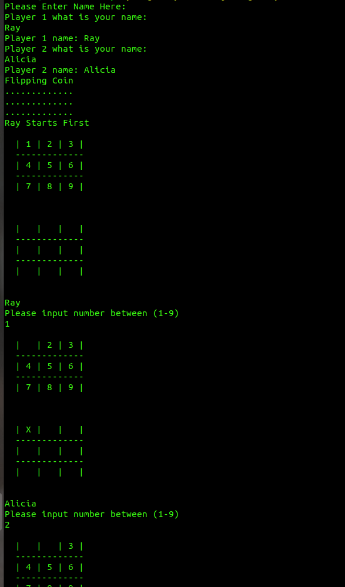

# tictactoe

> This is the third project in the Ruby module. In this project, we built a Tic-Tac-Toe game where we used the functionality of multiple files we built:
  main.rb
  board_info.rb
  game_logic.rb
  player_info.rb

## PREREQUISITE

- Install at least one code editor 
- Install Ruby to execute the project

## GETTING STARTED

- clone the repository `$ git clone git@github.com:aliciapaz/tictactoe.git`
- Open Terminal using (CTRL + ALT + T)
- `$ cd` to the clone repository
- Run the command `$  bin/main.rb`

## RULES
1. The game is played on a grid that's 3 squares by 3 squares.

2. You are X, your friend (or the computer in this case) is O. Players take turns putting their marks in empty squares.

3. The first player to get 3 of her marks in a row (up, down, across, or diagonally) is the winner.

4. When all 9 squares are full, the game is over. If no player has 3 marks in a row, the game ends in a tie.

## SCREENSHOT

## Built With

- Ruby
- Visual Studio Code 

## Author

👤 **Railon Acosta**

- GitHub: [@railonA](https://github.com/RailonA)
- Linkedin: [@railonA](https://www.linkedin.com/in/railon-acosta-81265180/)
- Twiter: [@railonAcosta](https://twitter.com/RailonAcosta)

👤 **Alicia Rojas**

- GitHub: [@alicia](https://github.com/aliciapaz)
- Linkedin: [@alicia](https://www.linkedin.com/in/alicia-rojas-71468418a/)
- Twiter: [@alicia](https://twitter.com/_alicia_paz)

## 🤝 Contributing

Contributions, issues, and feature requests are welcome!

Feel free to check the [issues page]( https://github.com/aliciapaz/tictactoe/issues ).

## Show your support

Give a ⭐️ if you like this project!

## 📝 License

This project is [MIT](LICENSE) licensed.